# *3.0 Análisis de Datos*
Excel ofrece herramientas poderosas para analizar grandes volúmenes de información. Estas funciones permiten explorar, limpiar y extraer conclusiones útiles a partir de los datos.

## 3.1 Ordenar
Permite reorganizar datos de forma ascendente o descendente según una o varias columnas. Se pueden ordenar datos numericos, texto o fechas. 

La forma en que se aplica el ordenamiento ya sea ascendente o descendente depende del tipo de dato, aunque no es comun tener varios tipos de datos en una sola columna, el criterio que sigue excel es el siguiente: 

1. Celdas vacías (siempre van al final en orden ascendente).
2. Números (ordenados por valor).
3. Fechas (ordenadas por valor, como números de serie).
4. Texto (ordenado alfabéticamente, respetando el orden Unicode).
5. Valores de error (#¡VALOR!, #N/A, etc.) suelen aparecer al final.

>**Fechas en Excel:**
Las fechas se manejan como números de serie que comienzan en el 1 de enero de 1900 (día 1), lo que permite ordenarlas cronológicamente.

A continuacion, se muestra un ejemplo de datos que representar ordenes de compra para distintas sucursales, contiene el nombre del proveedor, fecha de emisión, productos, costo unitario, monto, entre otros datos:

Datos que queremos Ordenar:
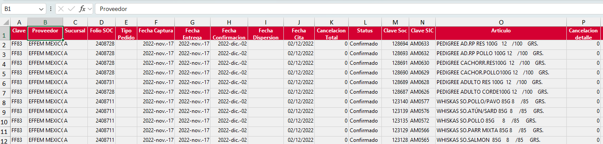

Para ordenar una coleccion de datos, puedes posicionarte en cualquier celda dentro de tu colección de datos y en la cinta de opciones ir a ``Datos`` en la sección ``Ordenar y Filtrar``  precionar el boton ``Ordenar``:
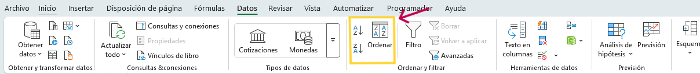

Al dar click se despliega la siguiente pantalla: 
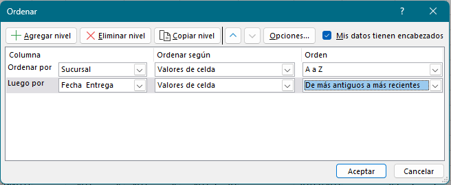

Allí podemos seleccionar que columna queremos que sea prioridad de ordenamiento, en este ejemplo, se selecciona sucursal y fecha de entrega, es decir que primero ordena por sucursal (alfabéticamente) y despues por los productos que se entregaron primero (ascendente)

>Cabe aclarar que este segundo factor de ordenamiento no altera el anterior, por lo que tendriamos primero todas las ordenes de compra de la primer sucursal ordenadas por recepción, luego ordenes de compra de la segunda sucursal ordenadas por recepción de esta forma hasta la ultima sucursal.

De esta forma podemos tener varios criterios de ordenamiento.

En caso que solo quisieramos ordenar por un solo criterio, podriamos hacer uso de los botones pequeños que se encuentran a la izquierda:
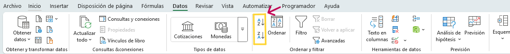

Puedes colocarte sobre la columna por la que quieres ordenar, por ejemplo el monto para ver los productos en los que estamos gastando mas, en este caso usariamos el icono inferior, que indica un orden descendente.

## 3.2 Filtrar

Ayuda a mostrar solo los datos que cumplen ciertos criterios, ocultando temporalmente el resto.

La forma comun de acceder al filtro es teniendo un conjunto de datos en forma tabular, es decir, con títulos de columnas y datos debajo que son filas que forman parte del conjunto al que describe el titulo de su columna, y al posicionarte en algun punto de tus datos precionar ``[ctrl + shift + L]`` o yendo a la pestaña ``Datos`` de la cinta de opciones en la sección ``Ordenar y Filtrar``  precionar el boton ``Filtro``

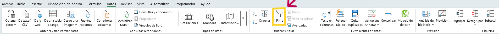

Usando el mismo conjunto de datos, al aplicar el filtro, aparecen unos pequeños botones para cada titulo de columna, sobre el que podemos seleccionar distintos tipos de filtros.

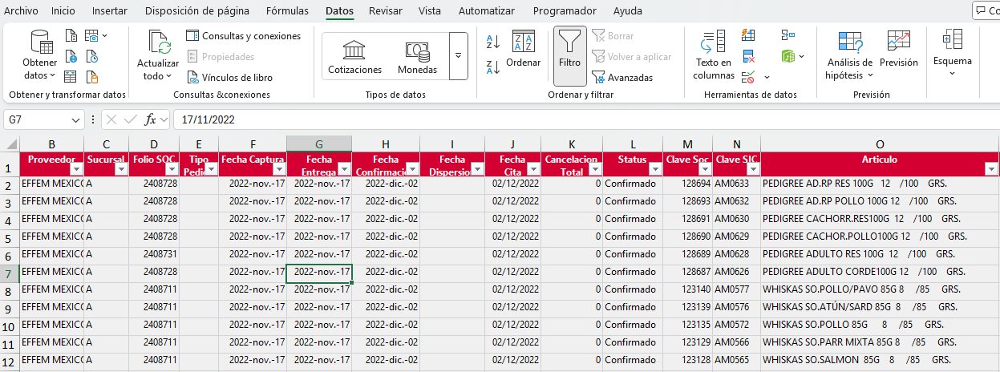

Tenemos distintos tipos de filtros y estos se habilitan dependiento el tipo de dato que contenga la columna sobre la cual deseamos aplicar el filtro.

**Filtros que puedes aplicar según si el contenido es texto, número o fecha:**

 1. Filtros para Texto

    Cuando filtras una columna de texto (como nombres, ciudades, categorías), Excel ofrece opciones como:

      - Filtro por lista de valores (checkbox con todos los valores únicos).
      - Contiene...
      - No contiene...
      - Empieza con...
      - Termina con...
      - Igual a...
      - Diferente de...
      - Filtro personalizado (combinación de condiciones con Y / O)

1. Filtros para Números

    Cuando Excel detecta datos numéricos, te muestra las siguientes opciones:

   - Igual a...
   - Mayor que / Menor que
   - Entre...
   - Superior al promedio / Inferior al promedio
   - Top 10... (o cualquier número: Top N mayores o menores)
   - Filtro personalizado

3. Filtros para Fechas

    Si la columna tiene datos con formato de fecha, Excel permite filtrar cronológicamente:

    - Por periodo de tiempo, agrupado en:
      - Años
      - Meses
      - Trimestres
      - Días
    - Hoy
    - Ayer
    - Mañana
    - Últimos 7 días
    - Esta semana / mes / año
    - Entre fechas
    - Antes de... / Después de...
    - Filtro personalizado

4. Filtros para Celdas Vacías o con Errores
    
    También puedes:
    - Filtrar celdas vacías
    - Filtrar celdas no vacías
    - Filtrar por errores (como #N/A, #DIV/0!)

>**Filtros por Formato**:
Además de filtrar por contenido, Excel permite filtrar por color de celda, color de texto o iconos aplicados mediante formato condicional. Esto es útil para destacar visualmente ciertos datos y luego trabajar solo con ellos.

A continuación vemos un ejemplo de como se muestran las opciones de filtro de datos, podemos observar que desde aqui tambien se puede realizar un ordenamiento simple:

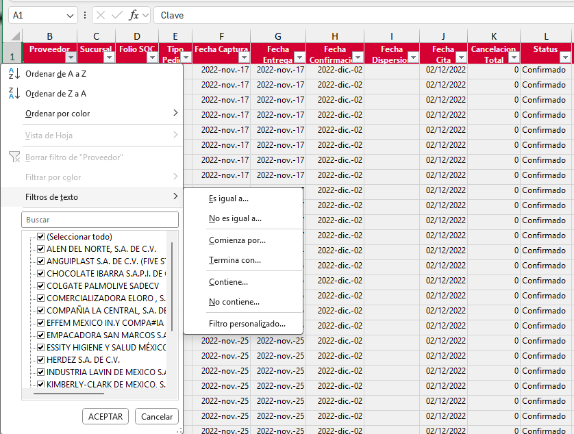

## 3.3 Subtotales

Los subtotales permiten agrupar datos y calcular automáticamente sumas, promedios, conteos, etc., por categoría dentro de una tabla. Son útiles para analizar grandes conjuntos de datos organizados por grupos, como ventas por región, productos por categoría, etc.

Usaremos los siguientes datos para el ejemplo:

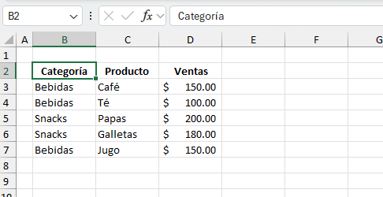

**Para aplicar subtotales:**

1. Ordena la tabla por la columna que se usará para agrupar (ej. “Categoría”).

    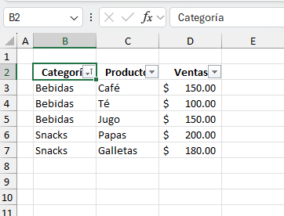

2. Ve a la pestaña Datos > Esquemas > Subtototal

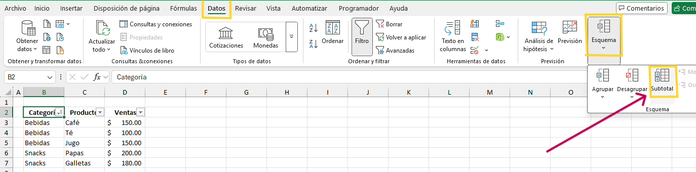

3. En el cuadro de diálogo:
   - “Para cada cambio en”: selecciona la columna de agrupamiento (ej. Categoría).
   - “Usar función”: elige la operación (Suma, Promedio, Contar…).
   - “Agregar subtotal a”: selecciona las columnas que se resumirán (ej. Ventas).
  
    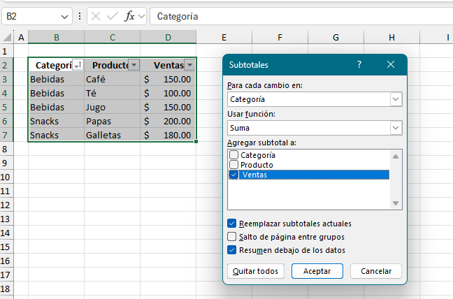
  
    Acepta y verás los subtotales insertados con niveles para expandir o contraer.
    
    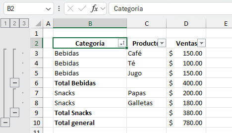

## 3.4 Validación de datos

Restringe los valores que pueden ingresarse en una celda para garantizar consistencia y evitar errores.

Ejemplo: Permitir solo fechas válidas o seleccionar valores de una lista desplegable con los nombres de departamentos.